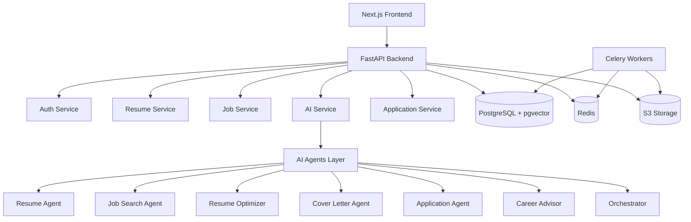

# JobAgent — Autonomous Job Application Platform

[](https://github.com/yourusername/autonomous-job-agent/actions/workflows/ci.yml)
[](LICENSE)

> **AI-powered job search, resume tailoring, and automated applications. Land your dream job faster.**

---

## Overview

JobAgent is a full-stack SaaS platform that automates the entire job search process. Upload your resume once, define your preferences, and let AI handle the rest — searching jobs, tailoring resumes, generating cover letters, and submitting applications.

### Key Features

- **Resume Parsing & AI Understanding** — Extract structured data from PDF/DOCX, generate skill graphs, career level estimation
- **Multi-Source Job Search** — Crawl Greenhouse, Lever, Wellfound, RemoteOK, YC Jobs, and more
- **Intelligent Matching** — AI-powered match scoring with explainable reasons
- **Resume Tailoring** — ATS-optimized, keyword-focused, always truthful
- **Cover Letter Generation** — Human-sounding, customizable tone
- **Auto-Apply** — Automated form filling with approval gates
- **Dashboard & Analytics** — Track applications, interviews, offers
- **AI Career Coach** — Personalized career advice and roadmap
- **Admin Panel** — User management, analytics, audit logs

### Tech Stack

| Layer | Technology |
|-------|------------|
| **Frontend** | Next.js 14, TypeScript, TailwindCSS, Shadcn UI, Framer Motion |
| **Backend** | FastAPI, Python 3.12+, SQLAlchemy 2.0, Alembic |
| **Database** | PostgreSQL 16 + pgvector (vector embeddings) |
| **Cache** | Redis 7 (caching, rate limiting, task queue) |
| **AI** | LangGraph, LangChain, OpenAI/Claude, Multi-provider |
| **Workers** | Celery + Redis (background tasks) |
| **Storage** | S3-compatible (MinIO for dev, AWS S3 for prod) |
| **Auth** | JWT (RS256), OAuth 2.0, Google Login, MFA (TOTP) |
| **Monitoring** | Prometheus + Grafana, OpenTelemetry, Sentry |
| **CI/CD** | GitHub Actions, Docker, Vercel (frontend), Railway/Fly.io (backend) |

---

## Architecture



See [docs/ARCHITECTURE.md](docs/ARCHITECTURE.md) for the full architecture document.

---

## Quick Start

### Prerequisites

- Docker & Docker Compose v2.24+
- Node.js 20+ (for local development without Docker)
- Python 3.12+ (for local development without Docker)

### Development Setup

```bash
# Clone the repository
git clone https://github.com/yourusername/autonomous-job-agent.git
cd autonomous-job-agent

# Create environment file
cp .env.example .env

# Start all services
docker compose up -d

# Run database migrations
docker compose exec api alembic upgrade head

# Seed sample data
docker compose exec api python scripts/seed_db.py

# Access the application
# Frontend: http://localhost:3000
# Backend API: http://localhost:8000
# API Docs: http://localhost:8000/docs
```

### Default Credentials

| Role | Email | Password |
|------|-------|----------|
| Admin | admin@jobagent.ai | AdminP@ss123 |
| Demo | demo@jobagent.ai | DemoP@ss123 |

---

## Project Structure

```
autonomous-job-agent/
├── backend/             # FastAPI application
│   ├── app/
│   │   ├── api/         # API routes (v1)
│   │   ├── agents/      # AI Agent definitions
│   │   ├── core/        # Config, security, database
│   │   ├── crawlers/    # Job source crawlers
│   │   ├── middleware/   # FastAPI middleware
│   │   ├── models/      # SQLAlchemy models
│   │   ├── schemas/     # Pydantic schemas
│   │   ├── services/    # Business logic
│   │   ├── utils/       # Utilities
│   │   └── workers/     # Celery tasks
│   ├── alembic/         # Database migrations
│   ├── tests/           # Backend tests
│   └── scripts/         # Utility scripts
├── frontend/            # Next.js application
│   ├── app/             # App Router pages
│   ├── components/      # React components
│   ├── hooks/           # Custom hooks
│   ├── lib/             # Utilities
│   ├── store/           # State management
│   └── types/           # TypeScript types
├── docs/                # Documentation
│   ├── ARCHITECTURE.md
│   ├── PRD.md
│   ├── database/SCHEMA.md
│   ├── api/END_POINTS.md
│   ├── SECURITY.md
│   ├── MILESTONES_RISKS_SCALING.md
│   ├── DEPLOYMENT.md
│   ├── TESTING.md
│   └── INTERVIEW_PREP.md
├── docker/              # Docker config files
├── docker-compose.yml   # Development setup
├── docker-compose.prod.yml  # Production setup
├── Makefile             # Common commands
└── README.md
```

---

## API Overview

| Endpoint | Description | Auth |
|----------|-------------|------|
| `POST /api/v1/auth/signup` | Register | No |
| `POST /api/v1/auth/login` | Login | No |
| `POST /api/v1/auth/google` | Google OAuth | No |
| `POST /api/v1/auth/refresh` | Refresh token | No |
| `POST /api/v1/resumes/upload` | Upload resume | Yes |
| `GET /api/v1/resumes` | List resumes | Yes |
| `GET /api/v1/resumes/{id}/analysis` | AI analysis | Yes |
| `POST /api/v1/jobs/search` | Search jobs | Yes |
| `POST /api/v1/applications` | Create application | Yes |
| `POST /api/v1/applications/{id}/submit` | Submit | Yes |
| `POST /api/v1/cover-letters/generate` | Generate cover letter | Yes |
| `POST /api/v1/ai/chat` | AI career coach | Yes |

Full API documentation: [docs/api/END_POINTS.md](docs/api/END_POINTS.md)

---

## Database

The system uses PostgreSQL 16 with the `pgvector` extension for vector embeddings. Key tables:

- `users` — Authentication and profile
- `resumes` — Uploaded resumes and parsed data
- `jobs` — Normalized job listings from all sources
- `job_applications` — Application tracking with status
- `cover_letters` — Generated cover letters
- `companies` — Company information
- `ai_requests` — AI usage tracking and billing

Full schema: [docs/database/SCHEMA.md](docs/database/SCHEMA.md)

---

## Security

- **JWT with RS256** — Asymmetric signing, stateless auth
- **Refresh token rotation** — Auto-revoke on reuse (theft detection)
- **Rate limiting** — Redis-based sliding window per endpoint
- **Password hashing** — bcrypt with cost factor 12
- **MFA (TOTP)** — Time-based one-time passwords
- **Security headers** — HSTS, CSP, XSS protection, X-Frame-Options
- **Prompt injection protection** — Input sanitization + output validation
- **Audit logging** — All sensitive actions logged immutably

Full security documentation: [docs/SECURITY.md](docs/SECURITY.md)

---

## Testing

```bash
# Run all tests
make test-backend   # Backend unit + integration tests
make test-frontend  # Frontend component tests
make test-e2e       # End-to-end Playwright tests

# Coverage
# Backend: pytest --cov=app --cov-report=html
# Frontend: npm run test -- --coverage
```

---

## Deployment

### Frontend (Vercel)

```bash
vercel --prod \
  --env NEXT_PUBLIC_API_URL=https://api.jobagent.ai \
  --env NEXT_PUBLIC_GOOGLE_CLIENT_ID=<id>
```

### Backend (Railway/Fly.io)

```bash
railway up    # Railway
fly deploy    # Fly.io
```

### Docker Production

```bash
docker compose -f docker-compose.prod.yml up -d
```

Full deployment guide: [docs/DEPLOYMENT.md](docs/DEPLOYMENT.md)

---

## Monitoring

- **Metrics:** Prometheus (`/metrics` endpoint)
- **Dashboards:** Grafana (pre-configured)
- **Logging:** Structured JSON logs via structlog
- **Error Tracking:** Sentry
- **Tracing:** OpenTelemetry (optional)

---

## Contributing

1. Fork the repository
2. Create a feature branch (`git checkout -b feature/amazing-feature`)
3. Commit your changes (`git commit -m 'Add amazing feature'`)
4. Push to the branch (`git push origin feature/amazing-feature`)
5. Open a Pull Request

### Development Guidelines

- Follow the feature workflow: Plan → Design → Test → Implement → Document
- Write tests for all new code
- Run linting before committing: `make lint`
- Update documentation for API changes

---

## License

MIT License — see [LICENSE](LICENSE) for details.

---

## Interview Notes

This project demonstrates:

- **System design** — Scalable architecture with clean separation
- **Full-stack development** — Modern React + FastAPI
- **AI integration** — Multi-provider abstraction, agent orchestration
- **Security** — Enterprise-grade auth, rate limiting, audit trails
- **DevOps** — Docker, CI/CD, monitoring, deployment
- **Database design** — Normalized schema with vector search
- **Testing** — Unit, integration, E2E, load, and security testing

See [docs/INTERVIEW_PREP.md](docs/INTERVIEW_PREP.md) for detailed architectural decisions and trade-off analysis.
