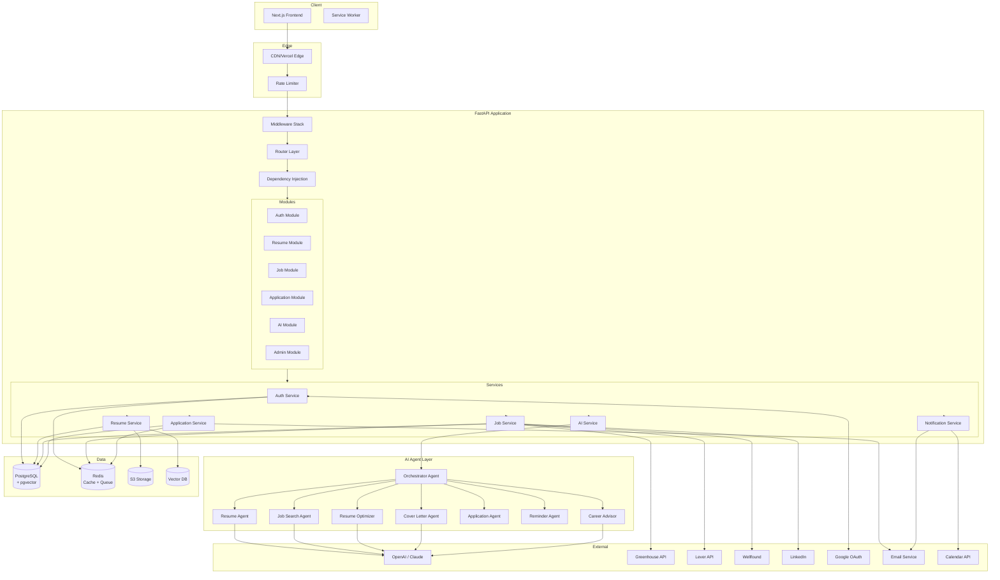

# Architecture Document

## 1. High-Level Architecture

```
┌─────────────────────────────────────────────────────────────────────┐
│                         CLIENT LAYER                                │
│  ┌──────────────┐  ┌──────────────┐  ┌──────────────┐              │
│  │   Next.js    │  │   React SPA  │  │   Mobile     │              │
│  │   (SSR/SSG)  │  │  (Dashboard) │  │  (Future)    │              │
│  └──────┬───────┘  └──────┬───────┘  └──────────────┘              │
│         │                  │                                        │
│  ┌──────┴──────────────────┴──────────────────────────────────────┐ │
│  │         CDN / Vercel Edge / CloudFront                         │ │
│  └──────────────────────────┬──────────────────────────────────────┘ │
└─────────────────────────────┼────────────────────────────────────────┘
                              │ HTTPS / WSS
┌─────────────────────────────┼────────────────────────────────────────┐
│                     API GATEWAY / REVERSE PROXY                      │
│  ┌──────────────┐  ┌───────┴───────┐  ┌──────────────┐              │
│  │  Rate Limit  │  │  NGINX / Caddy│  │  WAF/Helmet  │              │
│  └──────────────┘  └───────────────┘  └──────────────┘              │
└─────────────────────────────┬────────────────────────────────────────┘
                              │
┌─────────────────────────────┼────────────────────────────────────────┐
│                     APPLICATION LAYER                                │
│  ┌────────────────────────────────────────────────────────────────┐  │
│  │                    FASTAPI (Python 3.12+)                      │  │
│  │  ┌──────────┐ ┌──────────┐ ┌──────────┐ ┌──────────────────┐  │  │
│  │  │ Auth     │ │ Resume   │ │ Job      │ │ Application      │  │  │
│  │  │ Module   │ │ Module   │ │ Search   │ │ Module           │  │  │
│  │  └──────────┘ └──────────┘ └──────────┘ └──────────────────┘  │  │
│  │  ┌──────────┐ ┌──────────┐ ┌──────────┐ ┌──────────────────┐  │  │
│  │  │AI Agent  │ │ Matching │ │ Cover    │ │ Admin            │  │  │
│  │  │ Layer    │ │ Engine   │ │ Letter   │ │ Module           │  │  │
│  │  └──────────┘ └──────────┘ └──────────┘ └──────────────────┘  │  │
│  └────────────────────────────────────────────────────────────────┘  │
│                                                                      │
│  ┌────────────────────────────────────────────────────────────────┐  │
│  │                    AI / AGENT LAYER                            │  │
│  │  ┌──────────┐ ┌──────────┐ ┌──────────┐ ┌──────────────────┐  │  │
│  │  │Resume    │ │ Job      │ │ Resume   │ │ Cover Letter     │  │  │
│  │  │Agent     │ │ Search   │ │Optimizer │ │ Agent            │  │  │
│  │  └──────────┘ └──────────┘ └──────────┘ └──────────────────┘  │  │
│  │  ┌──────────┐ ┌──────────┐ ┌──────────┐ ┌──────────────────┐  │  │
│  │  │Applicant │ │ Reminder │ │ Career   │ │ Orchestrator     │  │  │
│  │  │Agent     │ │ Agent    │ │ Advisor  │ │ Agent            │  │  │
│  │  └──────────┘ └──────────┘ └──────────┘ └──────────────────┘  │  │
│  │  ┌────────────────────────────────────────────────────────┐    │  │
│  │  │  LangGraph (Agent Orchestration)                       │    │  │
│  │  │  LangChain (Prompt chains, tools, retrievers)          │    │  │
│  │  │  OpenAI / Claude / Gemini Adapters                     │    │  │
│  │  └────────────────────────────────────────────────────────┘    │  │
│  └────────────────────────────────────────────────────────────────┘  │
└─────────────────────────────┬────────────────────────────────────────┘
                              │
┌─────────────────────────────┼────────────────────────────────────────┐
│                     DATA LAYER                                       │
│  ┌──────────────┐  ┌───────┴───────┐  ┌──────────────┐              │
│  │  PostgreSQL  │  │    Redis      │  │  S3/S3-       │              │
│  │  (Primary)   │  │  (Cache + Q)  │  │  Compatible   │              │
│  │  + Read      │  │  + Rate Limit │  │  (Resumes,    │              │
│  │  Replicas    │  │  + Sessions   │  │   Cover       │              │
│  │              │  │  + Bull Queues│  │   Letters,    │              │
│  └──────────────┘  └──────────────┘  │   Logs)       │              │
│                                       └──────────────┘              │
│  ┌──────────────────────────────────────────────────────────────┐   │
│  │  Vector Database (Qdrant / pgvector)                         │   │
│  │  • Resume embeddings • Job description embeddings            │   │
│  │  • Company embeddings • User preference embeddings           │   │
│  └──────────────────────────────────────────────────────────────┘   │
└──────────────────────────────────────────────────────────────────────┘
```

## 2. Architecture Decisions

### 2.1 Why FastAPI over Django/Flask?

| Factor | FastAPI | Django | Flask |
|--------|---------|--------|-------|
| Async native | ✅ Native | ❌ Workarounds | ❌ Extensions |
| Performance | ✅ Fastest | ❌ Sync-heavy | ⚠️ Moderate |
| OpenAPI auto | ✅ Built-in | ❌ DRF needed | ❌ Separate |
| Type safety | ✅ Pydantic | ❌ No | ⚠️ Partial |
| AI/ML ecosystem | ✅ Python | ✅ Python | ✅ Python |

**Decision:** FastAPI supports async I/O natively, which is critical for:
- Streaming AI responses
- Concurrent file uploads
- Async database queries
- WebSocket connections for real-time updates

### 2.2 Why Next.js for Frontend?

- **SSR/SSG/ISR:** Mixed rendering for SEO (public pages) and CSR for dashboard
- **API Routes:** BFF pattern for auth token exchange
- **React Server Components:** Reduced client bundle
- **Middleware:** Route protection, redirects, A/B testing
- **TypeScript:** First-class support
- **Ecosystem:** Vercel deployment, TailwindCSS, Shadcn UI

### 2.3 Why PostgreSQL + pgvector?

- **pgvector** extension enables vector similarity search without a separate vector DB
- Mature, battle-tested relational database
- JSONB for semi-structured resume data
- Full-text search for job descriptions
- Excellent tooling (migrations, backups, replication)

**Fallback:** For >10M vectors, we may introduce Qdrant as a dedicated vector store.

### 2.4 Why Redis?

- **Cache:** Job search results, resume parsing, AI responses, company metadata
- **Rate Limiting:** Sliding window counters
- **Session Store:** Token blacklist / refresh token tracking
- **Task Queue:** Bull/Celery for async job crawling, AI calls
- **Pub/Sub:** Real-time notifications

### 2.5 Why LangGraph over Custom Agent Framework?

| Feature | LangGraph | Custom Framework |
|---------|-----------|-----------------|
| State graphs | ✅ Built-in | ❌ Build from scratch |
| Human-in-the-loop | ✅ Checkpointing | ❌ Complex |
| Tool calling | ✅ Native tools | ❌ Custom |
| Streaming | ✅ Built-in | ❌ Manual |
| Observability | ✅ LangSmith | ❌ Custom |

### 2.6 Why JWT + OAuth?

- **Stateless authentication:** Enables horizontal scaling
- **RS256 signing:** Public/private key pair — safe for microservices
- **Refresh tokens:** Balance security and UX
- **OAuth 2.0:** Google login reduces password fatigue
- **MFA readiness:** TOTP can be checked independent of JWT

## 3. Data Flow

### 3.1 Resume Upload & Processing Flow

```
User Uploads PDF
    → Pre-signed S3 URL generated
    → File validated (type, size, malware scan)
    → Stored in S3 bucket
    → Background task: Resume Parsing
        → python-docx / PyMuPDF extract text
        → OpenAI structured extraction
        → Confidence scoring
        → Store structured JSON in PostgreSQL
    → Background task: AI Understanding
        → Generate skill graph
        → Estimate career level
        → Detect industry
        → Identify gaps
        → Generate strengths/weaknesses
    → Notify user via WebSocket
```

### 3.2 Job Search Flow

```
User Triggers Search
    → Check Redis cache (key: search:hash(query+preferences))
    → If cache hit → return results
    → If cache miss → orchestrate search agents
        → Agent 1: Crawl Greenhouse API
        → Agent 2: Crawl Lever API
        → Agent 3: Crawl Wellfound
        → Agent 4: Crawl other sources
    → Normalize results into unified schema
    → Deduplicate
    → Store in PostgreSQL (jobs table)
    → Cache in Redis (TTL: 30min)
    → Run matching engine
    → Return ranked results
```

### 3.3 Application Submission Flow

```
User Selects Job → "Apply"
    → Check approval gate setting
    → If "always ask" → pause for user confirmation
    → Generate tailored resume
    → Generate cover letter
    → Prepare application payload
    → Check for resume upload requirement
    → Submit application
        → If form-based: Playwright/Puppeteer automation
        → If API-based: Direct API call
        → If email: Send via SMTP
    → Record result (success/fail + reason)
    → Update application status
    → Notify user
```

### 3.4 AI Agent Orchestration Flow

```
User Request
    → Orchestrator Agent (LangGraph)
        → Determine intent (resume analysis, job search, cover letter, etc.)
        → Route to specialized sub-agent
        → Sub-agent has tools:
            • get_resume_data()
            • search_jobs()
            • generate_resume()
            • generate_cover_letter()
            • submit_application()
            • get_company_info()
        → Sub-agent uses memory (conversation history)
        → Sub-agent returns structured response
    → Response streamed to frontend
```

## 4. Component Diagram (Mermaid)



## 5. Technology Stack Summary

| Layer | Technology | Justification |
|-------|------------|---------------|
| **Frontend** | Next.js 14+, TypeScript, TailwindCSS, Shadcn UI, Framer Motion | Modern, performant, excellent DX |
| **Backend** | FastAPI, Python 3.12+, SQLAlchemy 2.0, Alembic | Async, type-safe, auto-docs |
| **Database** | PostgreSQL 16 + pgvector | Relational + vector search |
| **Cache** | Redis 7 | Multi-purpose (cache, queue, rate limit) |
| **Queue** | Celery + Redis | Async task processing |
| **AI Framework** | LangGraph + LangChain | Agent orchestration |
| **AI Providers** | OpenAI GPT-4o, Claude 3.5, Gemini 1.5 | Multi-provider abstraction |
| **Vector Store** | pgvector (primary), Qdrant (future) | Embedding similarity search |
| **Storage** | AWS S3 / MinIO | Resume files, cover letters |
| **Auth** | JWT (RS256), OAuth 2.0, Google OAuth | Stateless, secure |
| **Monitoring** | Prometheus + Grafana | Metrics, dashboards |
| **Logging** | OpenTelemetry + structured JSON logs | Observability |
| **Deployment** | Docker, Docker Compose, GitHub Actions | Consistent, automated |
| **Hosting** | Vercel (frontend), Railway/Fly.io (backend) | Managed, scalable |

## 6. Security Architecture

```
┌──────────────────────────────────┐
│         Internet                 │
└──────────┬───────────────────────┘
           │ HTTPS (TLS 1.3)
┌──────────┴───────────────────────┐
│   WAF / DDoS Protection          │
│   (Cloudflare / AWS Shield)      │
└──────────┬───────────────────────┘
           │
┌──────────┴───────────────────────┐
│   Rate Limiting (Redis-based)    │
│   • Login: 5/min per IP          │
│   • Signup: 3/min per IP         │
│   • AI: 20/min per user          │
│   • Upload: 10/min per user      │
│   • API: 100/min per user        │
└──────────┬───────────────────────┘
           │
┌──────────┴───────────────────────┐
│   API Gateway (NGINX/Caddy)      │
│   • SSL termination              │
│   • Request validation           │
│   • CORS enforcement             │
│   • Security headers (Helmet)    │
└──────────┬───────────────────────┘
           │
┌──────────┴───────────────────────┐
│   FastAPI Middleware Stack        │
│   • CORS middleware               │
│   • CSRF middleware               │
│   • JWT verification              │
│   • Request ID injection          │
│   • Request logging               │
│   • Input sanitization            │
│   • Rate limit check              │
└───────────────────────────────────┘
```

## 7. Scaling Strategy

### 7.1 Horizontal Scaling
- **API servers:** Stateless FastAPI behind load balancer; scale via `docker-compose up --scale api=5`
- **Workers:** Separate Celery worker pool for AI tasks, job crawling, resume parsing
- **Frontend:** Vercel auto-scales; static assets via CDN

### 7.2 Database Scaling
- **Read replicas:** PostgreSQL read replicas for dashboard/analytics queries
- **Connection pooling:** PgBouncer for efficient connection management
- **Sharding:** Future consideration for user-based sharding at >10M users
- **Partitioning:** Time-based partitioning for logs, audit trails, AI requests

### 7.3 Caching Strategy
- **L1:** In-memory (per server) for hot data (TTL: 60s)
- **L2:** Redis cluster for shared cache (TTL: 30min)
- **L3:** CDN for static assets

### 7.4 AI Optimization
- **Batching:** Group AI requests where possible
- **Streaming:** Stream responses to reduce perceived latency
- **Caching:** Cache common AI responses (resume summaries, skill graphs)
- **Fallback models:** Cheaper/faster model for simple tasks
- **Token budgeting:** Track and limit per-user token consumption
