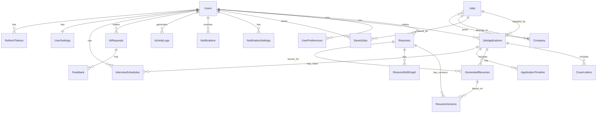

# Database Schema Design

## 1. Entity Relationship Diagram



## 2. Table Definitions

### 2.1 Users

```sql
CREATE TABLE users (
    id              UUID PRIMARY KEY DEFAULT gen_random_uuid(),
    email           VARCHAR(255) NOT NULL UNIQUE,
    password_hash   VARCHAR(255),
    full_name       VARCHAR(255) NOT NULL,
    avatar_url      VARCHAR(512),
    google_id       VARCHAR(255) UNIQUE,
    role            VARCHAR(20) NOT NULL DEFAULT 'user'
                    CHECK (role IN ('user', 'admin')),
    is_verified     BOOLEAN NOT NULL DEFAULT FALSE,
    mfa_enabled     BOOLEAN NOT NULL DEFAULT FALSE,
    mfa_secret      VARCHAR(255),
    is_active       BOOLEAN NOT NULL DEFAULT TRUE,
    last_login_at   TIMESTAMPTZ,
    created_at      TIMESTAMPTZ NOT NULL DEFAULT NOW(),
    updated_at      TIMESTAMPTZ NOT NULL DEFAULT NOW()
);

CREATE INDEX idx_users_email ON users(email);
CREATE INDEX idx_users_google_id ON users(google_id);
CREATE INDEX idx_users_role ON users(role);
```

### 2.2 Refresh Tokens

```sql
CREATE TABLE refresh_tokens (
    id              UUID PRIMARY KEY DEFAULT gen_random_uuid(),
    user_id         UUID NOT NULL REFERENCES users(id) ON DELETE CASCADE,
    token_hash      VARCHAR(255) NOT NULL,
    expires_at      TIMESTAMPTZ NOT NULL,
    is_revoked      BOOLEAN NOT NULL DEFAULT FALSE,
    created_at      TIMESTAMPTZ NOT NULL DEFAULT NOW(),
    revoked_at      TIMESTAMPTZ
);

CREATE INDEX idx_refresh_tokens_user ON refresh_tokens(user_id);
CREATE INDEX idx_refresh_tokens_hash ON refresh_tokens(token_hash);
```

### 2.3 User Settings

```sql
CREATE TABLE user_settings (
    id                  UUID PRIMARY KEY DEFAULT gen_random_uuid(),
    user_id             UUID NOT NULL UNIQUE REFERENCES users(id) ON DELETE CASCADE,
    theme               VARCHAR(20) NOT NULL DEFAULT 'light'
                        CHECK (theme IN ('light', 'dark', 'system')),
    language            VARCHAR(10) NOT NULL DEFAULT 'en',
    timezone            VARCHAR(50) NOT NULL DEFAULT 'UTC',
    approval_gate       VARCHAR(20) NOT NULL DEFAULT 'always_ask'
                        CHECK (approval_gate IN ('always_ask', 'trusted_sites', 'always_auto')),
    auto_submit         BOOLEAN NOT NULL DEFAULT FALSE,
    daily_application_limit INTEGER NOT NULL DEFAULT 20,
    created_at          TIMESTAMPTZ NOT NULL DEFAULT NOW(),
    updated_at          TIMESTAMPTZ NOT NULL DEFAULT NOW()
);
```

### 2.4 User Preferences

```sql
CREATE TABLE user_preferences (
    id                  UUID PRIMARY KEY DEFAULT gen_random_uuid(),
    user_id             UUID NOT NULL UNIQUE REFERENCES users(id) ON DELETE CASCADE,
    preferred_locations TEXT[] DEFAULT '{}',
    preferred_remote    VARCHAR(20) DEFAULT 'hybrid'
                        CHECK (preferred_remote IN ('remote', 'hybrid', 'onsite', 'any')),
    salary_min          INTEGER,
    salary_max          INTEGER,
    salary_currency     VARCHAR(3) DEFAULT 'USD',
    preferred_industries TEXT[] DEFAULT '{}',
    preferred_role_types TEXT[] DEFAULT '{}',
    preferred_companies TEXT[] DEFAULT '{}',
    excluded_companies  TEXT[] DEFAULT '{}',
    keywords            TEXT[] DEFAULT '{}',
    excluded_keywords   TEXT[] DEFAULT '{}',
    visa_required       BOOLEAN DEFAULT FALSE,
    open_to_relocation  BOOLEAN DEFAULT FALSE,
    created_at          TIMESTAMPTZ NOT NULL DEFAULT NOW(),
    updated_at          TIMESTAMPTZ NOT NULL DEFAULT NOW()
);
```

### 2.5 Resumes

```sql
CREATE TABLE resumes (
    id                  UUID PRIMARY KEY DEFAULT gen_random_uuid(),
    user_id             UUID NOT NULL REFERENCES users(id) ON DELETE CASCADE,
    file_key            VARCHAR(512) NOT NULL,
    file_name           VARCHAR(255) NOT NULL,
    file_size           INTEGER NOT NULL,
    file_type           VARCHAR(10) NOT NULL
                        CHECK (file_type IN ('pdf', 'docx')),
    parsed_data         JSONB,
    parsing_confidence  REAL,
    parsing_status      VARCHAR(20) NOT NULL DEFAULT 'pending'
                        CHECK (parsing_status IN ('pending', 'processing', 'completed', 'failed')),
    parsing_error       TEXT,
    is_active           BOOLEAN NOT NULL DEFAULT TRUE,
    created_at          TIMESTAMPTZ NOT NULL DEFAULT NOW(),
    updated_at          TIMESTAMPTZ NOT NULL DEFAULT NOW()
);

CREATE INDEX idx_resumes_user ON resumes(user_id);
CREATE INDEX idx_resumes_active ON resumes(user_id, is_active);
```

### 2.6 Resume Versions

```sql
CREATE TABLE resume_versions (
    id                  UUID PRIMARY KEY DEFAULT gen_random_uuid(),
    resume_id           UUID NOT NULL REFERENCES resumes(id) ON DELETE CASCADE,
    version_number      INTEGER NOT NULL,
    parsed_data         JSONB NOT NULL,
    change_summary      TEXT,
    created_at          TIMESTAMPTZ NOT NULL DEFAULT NOW(),
    UNIQUE(resume_id, version_number)
);

CREATE INDEX idx_resume_versions_resume ON resume_versions(resume_id);
```

### 2.7 Resume Skill Graph

```sql
CREATE TABLE resume_skill_graph (
    id                  UUID PRIMARY KEY DEFAULT gen_random_uuid(),
    resume_id           UUID NOT NULL REFERENCES resumes(id) ON DELETE CASCADE,
    skills              JSONB NOT NULL,  -- [{name, category, proficiency, years}]
    career_level        VARCHAR(30),
    industry            VARCHAR(100),
    missing_skills      JSONB,
    strengths           TEXT[],
    weaknesses          TEXT[],
    summary             TEXT,
    embedding           VECTOR(1536),
    created_at          TIMESTAMPTZ NOT NULL DEFAULT NOW(),
    updated_at          TIMESTAMPTZ NOT NULL DEFAULT NOW()
);

CREATE INDEX idx_resume_skill_graph_resume ON resume_skill_graph(resume_id);
```

### 2.8 Companies

```sql
CREATE TABLE companies (
    id                  UUID PRIMARY KEY DEFAULT gen_random_uuid(),
    name                VARCHAR(255) NOT NULL,
    website             VARCHAR(512),
    logo_url            VARCHAR(512),
    description         TEXT,
    industry            VARCHAR(100),
    size                VARCHAR(50),
    headquarters        VARCHAR(255),
    careers_page_url    VARCHAR(512),
    ats_provider        VARCHAR(50),
    embedding           VECTOR(1536),
    metadata            JSONB,
    created_at          TIMESTAMPTZ NOT NULL DEFAULT NOW(),
    updated_at          TIMESTAMPTZ NOT NULL DEFAULT NOW()
);

CREATE INDEX idx_companies_name ON companies(name);
CREATE UNIQUE INDEX idx_companies_name_website ON companies(name, website);
```

### 2.9 Jobs

```sql
CREATE TABLE jobs (
    id                  UUID PRIMARY KEY DEFAULT gen_random_uuid(),
    company_id          UUID REFERENCES companies(id),
    source              VARCHAR(50) NOT NULL
                        CHECK (source IN (
                            'greenhouse', 'lever', 'wellfound', 'linkedin',
                            'remoteok', 'yc_jobs', 'company_careers',
                            'rss_feed', 'indeed', 'manual'
                        )),
    source_job_id       VARCHAR(255),
    title               VARCHAR(255) NOT NULL,
    description         TEXT NOT NULL,
    description_embedding VECTOR(1536),
    location            VARCHAR(255),
    remote              VARCHAR(20)
                        CHECK (remote IN ('remote', 'hybrid', 'onsite', 'unspecified')),
    salary_min          INTEGER,
    salary_max          INTEGER,
    salary_currency     VARCHAR(3) DEFAULT 'USD',
    salary_interval     VARCHAR(20) DEFAULT 'yearly'
                        CHECK (salary_interval IN ('hourly', 'yearly', 'monthly')),
    employment_type     VARCHAR(50),
    experience_level    VARCHAR(50),
    skills_required     TEXT[],
    application_url     VARCHAR(1024),
    application_type    VARCHAR(20)
                        CHECK (application_type IN ('url', 'form', 'email', 'api', 'unknown')),
    expires_at          TIMESTAMPTZ,
    is_active           BOOLEAN NOT NULL DEFAULT TRUE,
    raw_data            JSONB,
    created_at          TIMESTAMPTZ NOT NULL DEFAULT NOW(),
    updated_at          TIMESTAMPTZ NOT NULL DEFAULT NOW(),
    UNIQUE(source, source_job_id)
);

CREATE INDEX idx_jobs_company ON jobs(company_id);
CREATE INDEX idx_jobs_source ON jobs(source);
CREATE INDEX idx_jobs_title ON jobs(title);
CREATE INDEX idx_jobs_location ON jobs(location);
CREATE INDEX idx_jobs_active ON jobs(is_active);
CREATE INDEX idx_jobs_created ON jobs(created_at DESC);
CREATE INDEX idx_jobs_salary ON jobs(salary_min, salary_max);
CREATE INDEX idx_jobs_skills ON jobs USING GIN(skills_required);
CREATE INDEX idx_jobs_embedding ON jobs USING ivfflat (description_embedding vector_cosine_ops);
```

### 2.10 Saved Jobs

```sql
CREATE TABLE saved_jobs (
    id                  UUID PRIMARY KEY DEFAULT gen_random_uuid(),
    user_id             UUID NOT NULL REFERENCES users(id) ON DELETE CASCADE,
    job_id              UUID NOT NULL REFERENCES jobs(id) ON DELETE CASCADE,
    match_score         REAL,
    match_reasons       JSONB,
    missing_skills      TEXT[],
    saved_at            TIMESTAMPTZ NOT NULL DEFAULT NOW(),
    UNIQUE(user_id, job_id)
);

CREATE INDEX idx_saved_jobs_user ON saved_jobs(user_id);
CREATE INDEX idx_saved_jobs_score ON saved_jobs(match_score DESC);
```

### 2.11 Job Applications

```sql
CREATE TABLE job_applications (
    id                  UUID PRIMARY KEY DEFAULT gen_random_uuid(),
    user_id             UUID NOT NULL REFERENCES users(id) ON DELETE CASCADE,
    job_id              UUID NOT NULL REFERENCES jobs(id) ON DELETE CASCADE,
    resume_id           UUID REFERENCES resumes(id),
    status              VARCHAR(30) NOT NULL DEFAULT 'draft'
                        CHECK (status IN (
                            'draft', 'saved', 'applied', 'screening',
                            'interview', 'offer', 'rejected', 'withdrawn',
                            'failed'
                        )),
    submission_data     JSONB,
    submission_result   JSONB,
    approval_required   BOOLEAN NOT NULL DEFAULT TRUE,
    approved_at         TIMESTAMPTZ,
    applied_at          TIMESTAMPTZ,
    source_application_id VARCHAR(255),
    notes               TEXT,
    created_at          TIMESTAMPTZ NOT NULL DEFAULT NOW(),
    updated_at          TIMESTAMPTZ NOT NULL DEFAULT NOW()
);

CREATE INDEX idx_applications_user ON job_applications(user_id);
CREATE INDEX idx_applications_job ON job_applications(job_id);
CREATE INDEX idx_applications_status ON job_applications(status);
CREATE INDEX idx_applications_user_status ON job_applications(user_id, status);
```

### 2.12 Application Timeline

```sql
CREATE TABLE application_timeline (
    id                  UUID PRIMARY KEY DEFAULT gen_random_uuid(),
    application_id      UUID NOT NULL REFERENCES job_applications(id) ON DELETE CASCADE,
    event_type          VARCHAR(50) NOT NULL,
    description         TEXT,
    metadata            JSONB,
    created_at          TIMESTAMPTZ NOT NULL DEFAULT NOW()
);

CREATE INDEX idx_timeline_application ON application_timeline(application_id);
CREATE INDEX idx_timeline_created ON application_timeline(created_at DESC);
```

### 2.13 Cover Letters

```sql
CREATE TABLE cover_letters (
    id                  UUID PRIMARY KEY DEFAULT gen_random_uuid(),
    application_id      UUID NOT NULL REFERENCES job_applications(id) ON DELETE CASCADE,
    content             TEXT NOT NULL,
    tone                VARCHAR(20) NOT NULL
                        CHECK (tone IN ('professional', 'short', 'custom')),
    word_count          INTEGER NOT NULL,
    ai_generated        BOOLEAN NOT NULL DEFAULT TRUE,
    user_edited         BOOLEAN NOT NULL DEFAULT FALSE,
    version             INTEGER NOT NULL DEFAULT 1,
    created_at          TIMESTAMPTZ NOT NULL DEFAULT NOW(),
    updated_at          TIMESTAMPTZ NOT NULL DEFAULT NOW()
);

CREATE INDEX idx_cover_letters_application ON cover_letters(application_id);
```

### 2.14 Generated Resumes

```sql
CREATE TABLE generated_resumes (
    id                  UUID PRIMARY KEY DEFAULT gen_random_uuid(),
    application_id      UUID NOT NULL REFERENCES job_applications(id) ON DELETE CASCADE,
    resume_id           UUID NOT NULL REFERENCES resumes(id),
    content             JSONB NOT NULL,
    file_key            VARCHAR(512),
    version             INTEGER NOT NULL DEFAULT 1,
    ai_generated        BOOLEAN NOT NULL DEFAULT TRUE,
    user_edited         BOOLEAN NOT NULL DEFAULT FALSE,
    ats_score           REAL,
    created_at          TIMESTAMPTZ NOT NULL DEFAULT NOW(),
    updated_at          TIMESTAMPTZ NOT NULL DEFAULT NOW()
);

CREATE INDEX idx_generated_resumes_application ON generated_resumes(application_id);
```

### 2.15 Interview Schedules

```sql
CREATE TABLE interview_schedules (
    id                  UUID PRIMARY KEY DEFAULT gen_random_uuid(),
    application_id      UUID NOT NULL REFERENCES job_applications(id) ON DELETE CASCADE,
    user_id             UUID NOT NULL REFERENCES users(id) ON DELETE CASCADE,
    interview_type      VARCHAR(50),
    scheduled_at        TIMESTAMPTZ NOT NULL,
    duration_minutes    INTEGER DEFAULT 60,
    location            VARCHAR(255),
    meeting_link        VARCHAR(512),
    notes               TEXT,
    reminder_sent       BOOLEAN NOT NULL DEFAULT FALSE,
    status              VARCHAR(20) NOT NULL DEFAULT 'scheduled'
                        CHECK (status IN ('scheduled', 'completed', 'cancelled', 'rescheduled')),
    created_at          TIMESTAMPTZ NOT NULL DEFAULT NOW(),
    updated_at          TIMESTAMPTZ NOT NULL DEFAULT NOW()
);

CREATE INDEX idx_interviews_user ON interview_schedules(user_id);
CREATE INDEX idx_interviews_application ON interview_schedules(application_id);
CREATE INDEX idx_interviews_scheduled ON interview_schedules(scheduled_at);
```

### 2.16 Notifications

```sql
CREATE TABLE notifications (
    id                  UUID PRIMARY KEY DEFAULT gen_random_uuid(),
    user_id             UUID NOT NULL REFERENCES users(id) ON DELETE CASCADE,
    type                VARCHAR(50) NOT NULL,
    title               VARCHAR(255) NOT NULL,
    body                TEXT,
    data                JSONB,
    is_read             BOOLEAN NOT NULL DEFAULT FALSE,
    read_at             TIMESTAMPTZ,
    created_at          TIMESTAMPTZ NOT NULL DEFAULT NOW()
);

CREATE INDEX idx_notifications_user ON notifications(user_id);
CREATE INDEX idx_notifications_unread ON notifications(user_id, is_read);
CREATE INDEX idx_notifications_created ON notifications(created_at DESC);
```

### 2.17 Activity Logs

```sql
CREATE TABLE activity_logs (
    id                  UUID PRIMARY KEY DEFAULT gen_random_uuid(),
    user_id             UUID NOT NULL REFERENCES users(id) ON DELETE CASCADE,
    action              VARCHAR(100) NOT NULL,
    resource_type       VARCHAR(50),
    resource_id         UUID,
    details             JSONB,
    ip_address          INET,
    user_agent          TEXT,
    created_at          TIMESTAMPTZ NOT NULL DEFAULT NOW()
)
PARTITION BY RANGE (created_at);

CREATE INDEX idx_activity_logs_user ON activity_logs(user_id);
CREATE INDEX idx_activity_logs_action ON activity_logs(action);
CREATE INDEX idx_activity_logs_created ON activity_logs(created_at DESC);
```

### 2.18 AI Requests

```sql
CREATE TABLE ai_requests (
    id                  UUID PRIMARY KEY DEFAULT gen_random_uuid(),
    user_id             UUID NOT NULL REFERENCES users(id) ON DELETE CASCADE,
    agent_type          VARCHAR(50) NOT NULL,
    model               VARCHAR(100) NOT NULL,
    prompt_tokens       INTEGER NOT NULL DEFAULT 0,
    completion_tokens   INTEGER NOT NULL DEFAULT 0,
    total_tokens        INTEGER NOT NULL DEFAULT 0,
    latency_ms          INTEGER NOT NULL DEFAULT 0,
    cost_cents          INTEGER NOT NULL DEFAULT 0,
    status              VARCHAR(20) NOT NULL
                        CHECK (status IN ('success', 'failed', 'partial')),
    error_message       TEXT,
    cache_hit           BOOLEAN NOT NULL DEFAULT FALSE,
    created_at          TIMESTAMPTZ NOT NULL DEFAULT NOW()
)
PARTITION BY RANGE (created_at);

CREATE INDEX idx_ai_requests_user ON ai_requests(user_id);
CREATE INDEX idx_ai_requests_agent ON ai_requests(agent_type);
CREATE INDEX idx_ai_requests_created ON ai_requests(created_at DESC);
```

### 2.19 Feedback

```sql
CREATE TABLE feedback (
    id                  UUID PRIMARY KEY DEFAULT gen_random_uuid(),
    user_id             UUID NOT NULL REFERENCES users(id) ON DELETE CASCADE,
    ai_request_id       UUID REFERENCES ai_requests(id),
    category            VARCHAR(50) NOT NULL,
    rating              INTEGER CHECK (rating >= 1 AND rating <= 5),
    comment             TEXT,
    created_at          TIMESTAMPTZ NOT NULL DEFAULT NOW()
);

CREATE INDEX idx_feedback_user ON feedback(user_id);
CREATE INDEX idx_feedback_category ON feedback(category);
```

### 2.20 Audit Logs

```sql
CREATE TABLE audit_logs (
    id                  UUID PRIMARY KEY DEFAULT gen_random_uuid(),
    actor_id            UUID REFERENCES users(id),
    action              VARCHAR(100) NOT NULL,
    resource_type       VARCHAR(50) NOT NULL,
    resource_id         UUID,
    old_values          JSONB,
    new_values          JSONB,
    ip_address          INET,
    user_agent          TEXT,
    created_at          TIMESTAMPTZ NOT NULL DEFAULT NOW()
)
PARTITION BY RANGE (created_at);

CREATE INDEX idx_audit_logs_actor ON audit_logs(actor_id);
CREATE INDEX idx_audit_logs_action ON audit_logs(action);
CREATE INDEX idx_audit_logs_resource ON audit_logs(resource_type, resource_id);
CREATE INDEX idx_audit_logs_created ON audit_logs(created_at DESC);
```

### 2.21 Password Reset Tokens

```sql
CREATE TABLE password_reset_tokens (
    id                  UUID PRIMARY KEY DEFAULT gen_random_uuid(),
    user_id             UUID NOT NULL REFERENCES users(id) ON DELETE CASCADE,
    token_hash          VARCHAR(255) NOT NULL,
    expires_at          TIMESTAMPTZ NOT NULL,
    used_at             TIMESTAMPTZ,
    created_at          TIMESTAMPTZ NOT NULL DEFAULT NOW()
);

CREATE INDEX idx_password_reset_user ON password_reset_tokens(user_id);
```

### 2.22 Email Verification Tokens

```sql
CREATE TABLE email_verification_tokens (
    id                  UUID PRIMARY KEY DEFAULT gen_random_uuid(),
    user_id             UUID NOT NULL REFERENCES users(id) ON DELETE CASCADE,
    token_hash          VARCHAR(255) NOT NULL,
    new_email           VARCHAR(255),
    expires_at          TIMESTAMPTZ NOT NULL,
    used_at             TIMESTAMPTZ,
    created_at          TIMESTAMPTZ NOT NULL DEFAULT NOW()
);

CREATE INDEX idx_email_verification_user ON email_verification_tokens(user_id);
```

## 3. PostgreSQL Extensions

```sql
CREATE EXTENSION IF NOT EXISTS "pgcrypto";      -- gen_random_uuid()
CREATE EXTENSION IF NOT EXISTS "vector";         -- pgvector
CREATE EXTENSION IF NOT EXISTS "pg_trgm";        -- Fuzzy text search
```

## 4. Partitioning Strategy

- `activity_logs` and `ai_requests` and `audit_logs`: Monthly range partitioning on `created_at`
- Creates monthly partitions automatically via pg_partman or cron job

## 5. Index Strategy

| Table | Index | Type | Reason |
|-------|-------|------|--------|
| users | email | B-tree | Login lookup |
| users | google_id | B-tree | OAuth lookup |
| jobs | description_embedding | IVFFlat | Vector similarity search |
| jobs | skills_required | GIN | Array contains queries |
| jobs | created_at | B-tree DESC | Latest jobs queries |
| applications | user_id, status | Composite B-tree | Dashboard queries |
| activity_logs | created_at | B-tree DESC | Timeline queries |

## 6. Row Level Security (RLS)

```sql
-- Users can only see their own data
ALTER TABLE resumes ENABLE ROW LEVEL SECURITY;
CREATE POLICY user_resumes ON resumes
    FOR ALL USING (user_id = current_user_id());

ALTER TABLE job_applications ENABLE ROW LEVEL SECURITY;
CREATE POLICY user_applications ON job_applications
    FOR ALL USING (user_id = current_user_id());
-- etc.
```

## 7. Estimated Storage

| Table | Est. Row Size | Est. Monthly Growth (1K users) | Total/Year |
|-------|--------------|-------------------------------|------------|
| users | 500 B | 1,000 rows | 5 MB |
| resumes | 2 KB | 2,000 rows | 48 MB |
| jobs | 3 KB | 50,000 rows | 1.8 GB |
| applications | 1 KB | 50,000 rows | 600 MB |
| activity_logs | 500 B | 500,000 rows | 3 GB |
| ai_requests | 200 B | 200,000 rows | 480 MB |
| audit_logs | 1 KB | 50,000 rows | 600 MB |

**Total estimated: ~6.5 GB/year for 1,000 active users**
